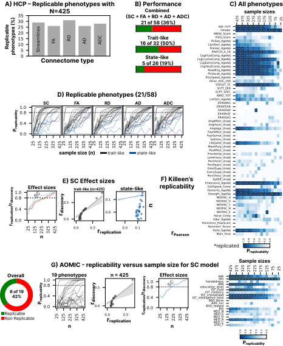

## Replicability of DWI Connectome-Based Brain-Wide Associations (BWAS)

### Overview

This project provides a comprehensive evaluation of the replicability of Brain-Wide Association Studies (BWAS) that are based on diffusion-weighted MRI (DWI) measures. We investigated how consistently associations between various DWI-derived brain metrics (including streamline connectivity, fractional anisotropy, and other tensor metrics) and a wide range of behavioral phenotypes can be replicated in independent samples.

### Methods

* **Data:** Analyses utilized the Human Connectome Project (HCP) dataset (N up to 425 per discovery/replication split, across 58 phenotypes) and the AOMIC dataset (N up to 425, 19 phenotypes) for validating streamline connectivity (SC) models.
* **DWI Metrics:** We assessed replicability for streamline connectivity (SC), fractional anisotropy (FA), radial diffusivity (RD), axial diffusivity (AD), and apparent diffusion coefficient (ADC).
* **Replicability Criteria:** A stringent definition of replicability was used, requiring a model to achieve significant prediction (p<0.05) in an unseen replication sample in over 80% of data shuffles, given a significant discovery set model.

### Key Findings

* Overall, 36% (21 out of 58) of the studied phenotypes demonstrated replicable BWAS in the HCP dataset.
* Trait-like behavioral measures showed higher replicability (50%, 16/32) compared to state-like measures (19%, 5/26).
* Streamline connectivity (SC) based models were found to be the most economical, requiring smaller average discovery sample sizes (n≈171) and showing higher replicable effect sizes.
* SC models successfully replicated 42% of tested phenotypes in the AOMIC validation dataset.
* Exploratory analyses indicated that using higher-resolution atlases could potentially improve replicability.
* SHAP analyses on replicable models identified influential white matter tracts that significantly correlated with their target behavioral measures, underscoring the potential for interpretable DWI-based brain-behavior characterization.

### Implications & Future Directions

This work highlights the critical roles of sample size, choice of connectome/DWI metric, and the nature of the phenotype in achieving replicable DWI-based BWAS.
* For **trait-like phenotypes**, further robust analyses and validation in larger datasets are essential.
* For **state-like phenotypes**, pursuing higher sample sizes and integrating dynamic neuroimaging modalities (e.g., fMRI, EEG, MEG) could be highly beneficial for advancing our understanding, particularly in areas like mental health.

### Main Figure

  Replicability of DWI-predictive models of behaviour with small-to-medium sample sizes. <strong>A)</strong> Percentage of replicable brain-phenotype models within the HCP dataset. N = 425 refers to the maximum number of samples used to train-test predictive models in the discovery phase. The discovery set and replication set were always split equally. Overall performance across DWI-connectome types is comparable. <strong>B)</strong> Overall, 21 out of 58 phenotype models were replicable, including both trait-like and state-like measures. Brain-based characterizations of long-term traits were more replicable in comparison to characterizations of the short-term, fluctuating nature of state-like measures. <strong>C)</strong> Heatmap displaying all the HCP behavioral measures and at what sample sizes they have demonstrated replicability. <strong>D)</strong> A closer look at the 21 phenotypes that were replicable via different DWI models. It can be observed that SC models saturate faster in comparison with their connectome counterparts. <strong>E)</strong> Effect sizes in the SC models, namely: i. average replicable effect sizes in the brain-phenotype models that passed the replication test, and ii. and iii. both trait-like and state-like effect sizes (discovery sample-based r and replication sample-based r) across different phenotypes at n=425. <strong>F)</strong> Empirically calculated replication effect size-driven theoretical sample sizes, showing an inverse relationship between effect sizes and sample sizes. Caution should be taken, especially for phenotypes that replicate at higher sample sizes, as these phenotypes also tend to produce lower effect sizes. <strong>G)</strong> Replication analysis for the SC models based on the AOMIC dataset. Similar to the HCP dataset, DWI-based connectivity showed comparable brain-phenotype replication models, in terms of sample sizes as well as effect sizes.

### Data Availability Statement

The Jupyter notebooks containing the analysis code, key methodological information, and processing steps for this study are provided within this repository. These notebooks allow for an understanding of how the main results were generated. The primary processed neuroimaging derivatives (e.g., full subject-level connectome matrices, voxel-wise diffusion metric maps) used in this research are not directly hosted in this repository. 
